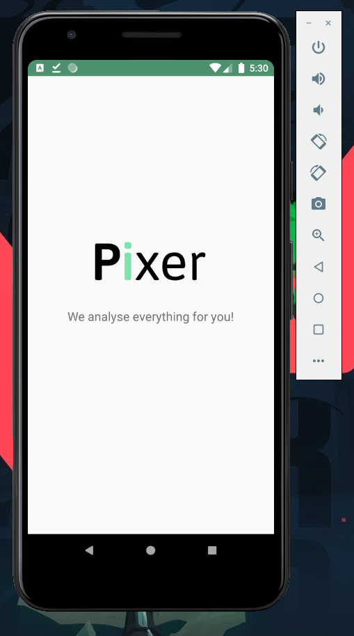
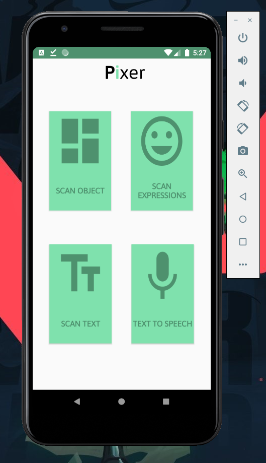
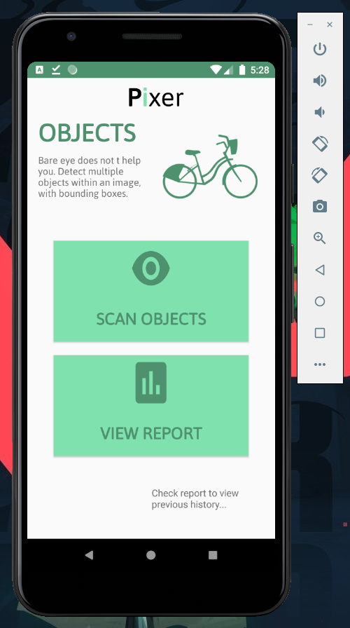
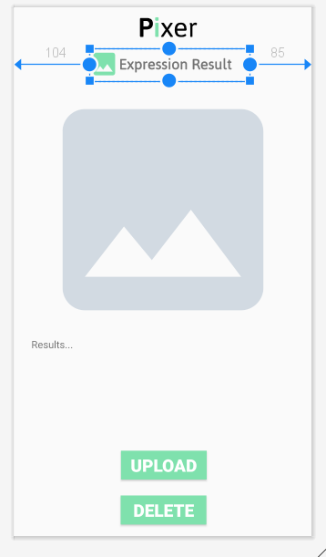

# Project-Pixer
## Android Project (Android Studio, Java, Firebase, Google Services, Google API) 4- member group project leaded by me.
Aug 2020 – Oct 2020  
An android app developed with Google Machine Learning API’s. You can detect objects, facial expressions, faces and copy text from an image.  

## Screenshot 
### Welcome
  
### Function selection 
  
### Function option(Ex: Object)
 
### Image selection
 
 
